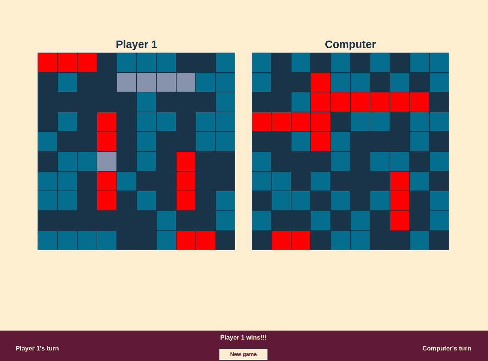

# Battleship

A browser-based implementation of the classic strategy game Battleship. This project demonstrates Object-Oriented Programming (OOP) principles, asynchronous state management, and the Publish/Subscribe design pattern using vanilla JavaScript.

Coded by a human, not by AI, with the exception of ship placement preview feature.



## 🚀 Features

- **Interactive Ship Placement:** Players can hover to preview ship positions and press `R` to rotate ships dynamically before placement.
- **Smart Computer Opponent:** The computer places ships randomly and utilizes a "Hunt and Target" algorithm (searches adjacent cells upon a successful hit).
- **Asynchronous Game Loop:** Uses JavaScript Promises and `async/await` to manage turn-based flow without blocking the main thread.
- **Event-Driven UI:** Updates the game state and message logs using a custom PubSub implementation.
- **Responsive Design:** CSS Grid layout ensures the game board scales appropriately on different screen sizes.

## 🛠️ Technologies & Patterns

- **Languages:** HTML5, CSS3, JavaScript (ES6+ Modules)
- **Architecture:**
  - **OOP:** Logic encapsulated in `Player`, `Gameboard`, and `Ship` classes.
  - **Pub/Sub Pattern:** Decouples the game logic from the UI message system (`PubSub.js` handles event dispatching).
  - **Module Pattern:** Keeps global namespace clean by exporting specific functions from `ui.js` and `index.js`.
- **Styling:** Custom CSS with CSS Variables and Josh Comeau's CSS Reset.
- **Unit Testing:** Full unit testing suite with Jest for Gameboard.js, Ship.js, and Player.js.

## 📂 Project Structure

```text
/src
 ├── Gameboard.js    # Logic for board state, hit detection, and ship validation
 ├── Player.js       # Manages player type (human/computer) and turn state
 ├── Ship.js         # Logic for ship health and sunk status
 ├── ui.js           # DOM manipulation and event listeners
 ├── PubSub.js       # Event bus for broadcasting game events
 ├── Message.js      # Handles UI text updates via PubSub subscription
 ├── index.js        # Entry point and game loop initialization
 └── styles.css      # Game styling
```

## 🧠 Key Technical Decisions

### Asynchronous User Input

Instead of using global state flags to track "whose turn it is," the game loop uses `await` to pause execution until a Promise resolves. This makes the `game()` function read like synchronous code while handling user interaction asynchronously.

```javascript
// Example from index.js
while (!restart) {
  const players = newGame()
  await placeShips(players) // Pauses here until user finishes placement
  playerTurns(players)
}
```

### The "Hunt and Target" Algorithm

The computer doesn't just fire randomly. When it records a hit, it enters a "Target" mode, prioritizing adjacent cells (`computerFire` logic) to sink the ship before returning to random firing.

## 📦 Installation & Setup

1.  **Clone the repository**

    ```bash
    git clone [https://github.com/yourusername/battleship.git](https://github.com/yourusername/battleship.git)
    cd battleship
    ```

2.  **Install dependencies**
    _(Assuming usage of npm/webpack)_

    ```bash
    npm install
    ```

3.  **Run the project**
    ```bash
    npm start
    ```

## 🔮 Future Improvements

- **Refactor AI Logic:** Separate the Computer AI logic out of `ui.js` into a dedicated `AIPlayer` class to improve Separation of Concerns.
- **Drag and Drop:** Implement the HTML5 Drag and Drop API for smoother ship placement.

## 📄 License

This project is open source and available under the [MIT License](https://mit-license.org/).
